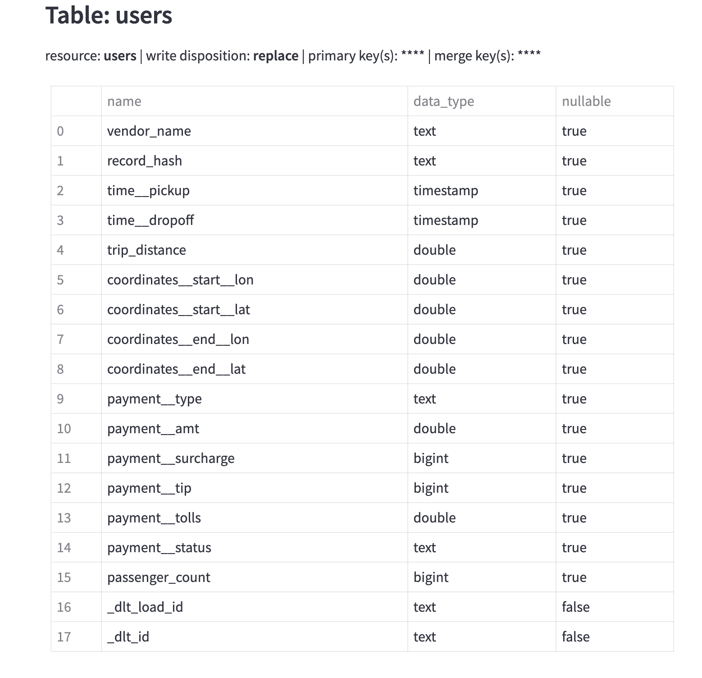

# dlt-workshop 2024

I'm excited to share insights from our recent workshop focused on crafting robust, scalable and self-maintaining pipelines. Led by the knowledgeable [Adrian Brudaru](https://www.linkedin.com/in/data-team/) from [dlthub](https://dlthub.com/), this session was a deep dive into the intricacies of data engineering. If you missed it, don't worry - the entire workshop has been recorded and is available on [YouTube](https://www.youtube.com/watch?v=oLXhBM7nf2Q).

## Exploring Data Ingestion Pipelines
We explored the essential steps of constructing data ingestion pipelines, covering everything from extracting data from APIs or files to normalizing and loading data. This foundational knowledge lays the groundwork for efficient data management and analysis within organizations.

## Introducing dlt: Simplifying Data Loading

Dlt (data load tool), an open-source library is designed to simplify data loading from various sources into well-structured datasets. Dlt automates many tedious tasks faced by Data Engineers, including schema inference, data typing and stream processing, making pipeline development more efficient and robust.

It does this by first extracting the data from an API or a similar source, then normalizing it to a schema, which will automatically evolve to any future source data changes (e.g. new fields or tables) and finally loading it to the location where you will store it (e.g. Google BigQuery).

## Installation

pip install dlt

In this workshop we used duckdb as a destination.

DuckDB is a fast in-process analytical database with zero external dependencies and runs in-process in its host application or as a single binary.

To install it use this command:

pip install "dlt[duckdb]"

If you are running dlt locally you can use the built in **streamlit app** by running the cli command with your pipeline name.

First installation: pip install streamlit

Then cli command: dlt pipeline "your pipline name" show

Example:

## Empowering Incremental Loading

We concluded the workshop by exploring the concept of incremental loading, a technique that updates datasets with new data by loading only the new data rather than replacing the entire dataset. This approach enhances pipeline efficiency and cost-effectiveness, working in tandem with incremental extraction and state management.

There are two methods supported by dlt for incremental loading: 
- Append, suitable for immutable or stateless events; 
- Merge, for updating changing data such as payment statuses.
